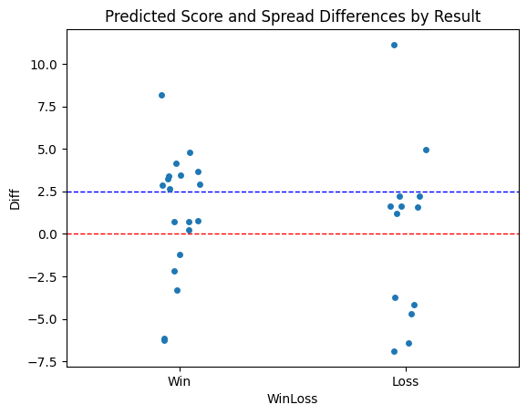
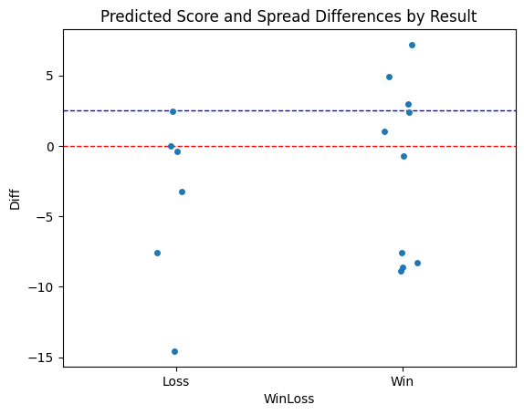

# 2025 NCAA Men's Basketball Spread Prediction 
Data Source:  Sports Reference https://www.sports-reference.com/cbb/seasons/men/2024-advanced-school-stats.html

Data cleaned using Apple Numbers

Report Published April 2025

## Executive Summary

This report introduces a random forest regressor model designed to predict the point differential in NCAA Men's Basketball Tournament games, with the goal of identifying winning bets against the spread. Trained on a dataset of 96 first-round games from 2022-2024, the model achieved a 59% accuracy rate (19/32) in predicting the outcomes of 2025 first-round matchups.

Crucially, the model demonstrated significant predictive power when identifying favored teams likely to cover the spread. When the model projected the higher seed to win by a margin exceeding the spread (predicted score difference - spread > 0), the accuracy rate jumped to 64% (14/22). This success rate further escalated to an impressive 83% (10/12) when the predicted margin surpassed 2.5 points.

This report delves deeper into the model's performance across subsequent rounds of the 2025 tournament, exploring its potential to consistently identify profitable betting opportunities throughout March Madness. The findings suggest a promising approach to leveraging machine learning for predicting scores and capitalizing on favorable point spreads. Let's go to Vegas!

## Technical Summary

This section details the construction and performance of the random forest regressor model used to predict point differentials in NCAA Men's Basketball Tournament games.

### Model Development

The model utilizes a supervised learning algorithm known as a random forest regressor. This approach leverages the power of multiple decision trees, each trained on a randomly selected subset of the training data and features. This ensemble method promotes robustness and mitigates the risk of overfitting, which is crucial when dealing with the inherent variability of basketball games.

The model was trained on a dataset encompassing 96 first-round games from the 2022, 2023, and 2024 NCAA Men's Basketball Tournaments. Each game was represented by 16 features, each calculated as the difference between the higher seed's (seeds 1-8) regular season statistics and the lower seed's (seeds 9-16) corresponding statistics.

<u>Features in Order of Model Importance</u>
1. Simple Rating System (SRS - 30%)
2. Strength of Schedule (SOS - 23%)
3. Steal Percentage (STL% - 6%)
4. Block Percentage (BLK% - 5%)
5. Turnover Percentage (TOV% - 5%)
6. Team Rebound Percentage (TRB% - 5%)
7. Possessions per 40 Minutes (Pace - 5%)
8. 3-Point Attempt Rate (3PAr - 3%)
9. Offensive Rebound Percentage (ORB% - 3%)
10. Free Throws per Field Goal Attempt (FT/FGA - 3%)
11. Tournament Seed (Seed - 3%)
12. Assists Percentage (AST% - 3%)
13. Points Scored per 100 Possessions (ORtg - 2%)
14. Free Throw Rate (FTr - 2%)
15. Effective Field Goal Percentage (eFG% - 1%)
16. True Shooting Percentage (TS% - 1%) 

**Model Performance**

The trained model yielded a mean squared error (MSE) of 5.12 and an R-squared (R²) value of 0.7587. An MSE of 5.12 suggests an average error of roughly 2.3 points in predicting the point differential, a promising result given the unpredictable nature of tournament basketball. The R² value of 0.7587 indicates that the model explains 76% of the variance in point differentials, suggesting a strong ability to capture the underlying relationships within the data.

The following link displays every Round 1 game, including each team’s seed, the betting spread, predicted score difference, actual score difference, and whether the model prediction resulted in a win or loss. The spread comes from multiple sportsbooks—primarily FanDuel and ESPN Bet—and reflects how many points the higher seed is expected to win by. If the spread is negative, it means the lower seed is actually favored to win according to the sportsbooks.

The predicted score difference is generated by the model and represents the expected margin between the higher and lower seed. The actual score difference is calculated as the higher seed’s final score minus the lower seed’s final score.

A "win" occurs when both the predicted and actual score differences fall on the same side of the spread. In other words, if the model predicts a score difference greater than the spread (favoring the higher seed), and the actual result is also greater than the spread, the bet is considered successful. A "loss" is recorded when the predicted and actual outcomes fall on opposite sides of the spread.

[2025 Round 1 Predicted Score Difference and Outcome](tableR1.md)

    Round 1 Win/Loss Against the Spread
        Win     19
        Loss    13

An interesting pattern emerged in these results. When the Predicted Score exceeded the Spread, the win rate was 64%. Even more impressively, when the Predicted Score was more than 2.5 points higher than the Spread, the win rate jumped to 83%.

    Round 1 Win/Loss Against the Spread (Predicted Score - Spread > 0)
        Win     14
        Loss     8

    Round 1 Win/Loss Against the Spread (Predicted Score - Spread > 2.5)
        Win     10
        Loss     2

Although the model was not trained using Round 2 data, the following results demonstrate how well it performed when applied to the 2025 Round 2 games. Impressively, the model correctly predicted 10 out of 16 winners (63%). The accuracy increased to 80% (5 out of 6) when the Predicted Score exceeded the Spread, and reached a perfect 100% (3 out of 3) when the Predicted Score was more than 2.5 points greater than the Spread.

[Model Applied to 2025 Round 2 Games](tableR2.md)

## Conclusion

This report demonstrates the potential of a random forest regressor model to effectively predict point differentials in NCAA Men's Basketball Tournament games, particularly in identifying instances where favored teams are likely to cover the spread. While further analysis across subsequent tournament rounds is necessary, the model's strong performance in the first round, achieving a 64% accuracy rate when predicting higher seeds to win by a margin exceeding the spread, suggests a promising avenue for identifying profitable betting opportunities. Future work will focus on refining the model's predictive power by incorporating additional variables, such as advanced team metrics and player-specific data, with the goal of building a comprehensive system for navigating the thrills and upsets of March Madness.

### Alternative Predictions and Data Organization:

**Predicting Total Points**: Instead of (or in addition to) predicting the point differential, train your model to predict the total combined score of each game. This could uncover different betting opportunities, especially in games with high or low over/under lines.

**Seed-Based Subsets**: Analyze how your model performs on different seed matchups. For example, does it predict 1 vs. 16 games more accurately than 5 vs. 12 games? This could highlight specific matchups where your model excels.

**Conference-Specific Trends**: Explore whether incorporating conference data improves predictions. Do teams from certain conferences consistently over- or underperform in the tournament? This could provide a valuable edge.

<u>Data Expansion and Model Refinement</u>

**Rolling Window Approach**: Experiment with a rolling window approach to model training. For example, train on 2023-2025 data to predict 2026, then on 2024-2026 to predict 2027, and so on. This helps capture evolving playing styles and trends.

**Upset Prediction**: Specifically analyze how your model performs on predicting upsets (seeds 12-16 winning). Are there particular features that stand out in these games? This could lead to a specialized upset prediction model.

<u>Additional Data Points for Enhanced Prediction</u>

**Advanced Metrics**: Incorporate advanced statistics like offensive/defensive efficiency, tempo, effective field goal percentage, and turnover rate. These provide a more nuanced picture of team performance.

**Player Data**: Include key player statistics or even advanced metrics like Player Efficiency Rating (PER) or Win Shares. Consider factors like injuries to key players.

**Tournament Experience**: Quantify a team's recent tournament experience (e.g., Sweet Sixteen appearances, Final Four appearances in the past 3-5 years). Experienced teams might perform differently under pressure.

**Coaching**: While harder to quantify, consider incorporating factors like coaching experience and coaching style (e.g., offensive vs. defensive minded).
 

 

 

